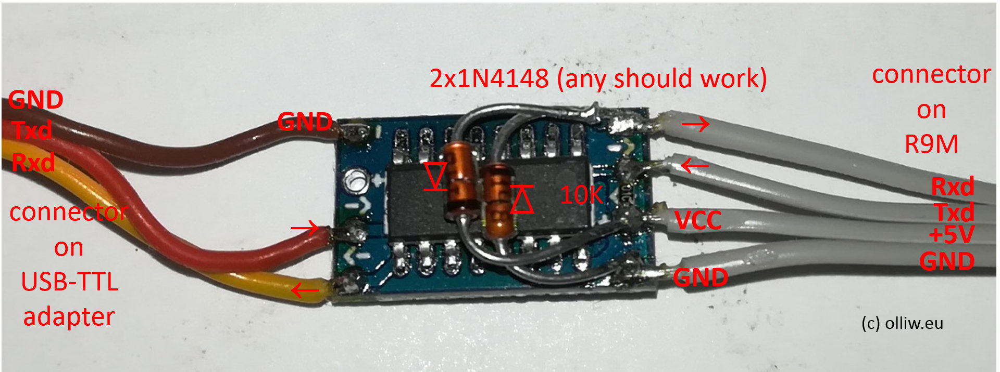

# mLRS Documentation: Frsky R9M, R9MX #

([back to main page](../README.md))

The Frsky R9M transmitter module and R9MX receiver are commercially available and hence interesting hardware for mLRS. However, the R9 system also provides some hurdles in that flashing is currently a bit of a hack and in that the R9M hardware is not entirely fit for the purpose.

Comment: mLRS also supports the R9MM receiver. However, flashing the R9MM with ST-Link is really tedious and requires top soldering skills or employing other tricks, as one needs to connect to four tiny solder pads. You really should consider using the R9MX receiver instead.

## R9M Tx Module ##

The R9M module is unfortunately limited with respect to serial ports. It provides acess to only one serial port, which moreover has inverted TTL signals. In order to use this serial port, these conditions apply:

1. One needs to use a "Frsky inverter" dongle. You either can buy one or build it yourself.

2. The serial port of the R9M module can be configured to work either as "serial" or "CLI". This is done by setting the dip switch 1 (left dip switch): off (switch down) = CLI, on (switch up) = serial. Note that the dip switch position is read only at power up, i.e., one needs to repower the module to make any change effective.

### DIY Inverter Dongle ###

There are several DIY apporaches for building the inverter dongle. A common approach is based on the MAX3232 RS232 chip; an excellent build tutorial is provided here [Some soldering required](https://discuss.ardupilot.org/t/some-soldering-required/27613). Be aware however that many fake chips are available, and the original scheme suggested in this blog may not work. One in fact may have to add an extra diode and resistor.

### Cooling ###

With mLRS the R9M module will require active cooling when running at power levels above 500 mW, but cooling might be advisable also at lower powers, at 500 mW or even 250 mW.

A description for installing a fan along with documentation for 3D printed case covers with fan mount can be found here https://www.expresslrs.org/2.0/hardware/fan-mod/. Note: The PB9 mechanism described there to control the fan is available with mLRS too.

## R9MX receiver ##

The R9MX receiver can used as Rx or as Tx module.

### As Rx module ###

The wiring is similar to the ExpressLRS docs found in the link below. Different from ExpressLRS project the SBUS-out-pin is available.

### As Tx module ###

The R9MX-receiver (in official Frsky naming) can used as Tx module too. Due to hardware limitations it is a very limited Tx module with special applications in mind. The module can be configured via CLI only. The CLI shares the same serial port with the Mavlink communication. Switching between CLI and serial port is done by "Bind" button.
- wiring:
similar to Rx and ExpressLRS. Optional the "Inerted SPort" pin (orginal naming) is available as input for SBUS or inverted SBUS signal.
- usage:
Powering up the R9MX without holding down the button (default) will boot in "Serial" mode.
To enter the CLI mode press the "Bind button" while powering up. The device run's in CLI mode. RX and TX can be configured as usual via CLI commands.

## Flashing ##

ExpressLRS has figured out a convenient and easy way for flashing, which is unfortunately not available for mLRS (someone needs to figure it out). For flashing mLRS only the grass-route DIY procedure using a ST-Link programmer is currently possible.

Note: Fashing mLRS with the ST-Link is a non-reversible operation, i.e., it is not possible to revert back to the original Frsky firmware. It is possible to switch to ExpressLRS however.

In principle, the procedure goes exactly as already described in the ExpressLRS docs:
- R9M module: https://www.expresslrs.org/1.0/quick-start/tx-r9m/#flashing-using-stlink
- R9MX receiver: https://www.expresslrs.org/1.0/quick-start/rx-stlink/

In these docs it is suggested to download and use the "ST-LINK Utility" software. This software is pretty outdated (NRND = not recommended for new designs), and the new recommended tool is "STM32CubeProgrammer". However, there might be catches:
- ST-LINK Utility appears to not work with newer ST-Link programmers.
- STM32CubeProgrammer/STM32CubeIDE is quite nasty with which ST-Link programmer is used. It seems ST really wants their tools to only work well with "original" or legit ST-Link programmers. I especially had significant issues with getting the cheap and widely available 8$ STLinkV2 usb-stick-like clones to work with STM32CubeProgrammer/STM32CubeIDE, and they then never worked reliably or to my satisfaction.
- It seems it can happen that ST-LINK Utility and STM32CubeProgrammer/STM32CubeIDE do not like each other.
- STM32CubeProgrammer runs per default at a high SWD frequency, like 4000 kHz, on the 8$ STLinkV2 clones. Setting the frequency manually to 480 kHz and using short wires to the device makes it work more reliable.

So, if you use or want to use one of these 8$ STLinkV2 usb-stick-like clones, you probably want to install ST-LINK Utility and see how that works for you. You will then (likely) not be able to flash from STM32CubeIDE, but have to go with the ST-LINK Utility.

If anyone has deeper/better insight into the STM32CubeProgrammer/STM32CubeIDE vs ST-LINK Utility and cheap STLinkV2 programmer clones issues, please help :)

If you wonder what STLink programmer I (olliw42) am using: Every NUCLEO board comes also with a STLink programmer... and these board are relatively cheap too, about 15Eur.

